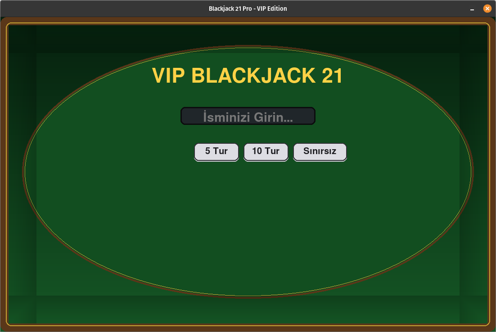
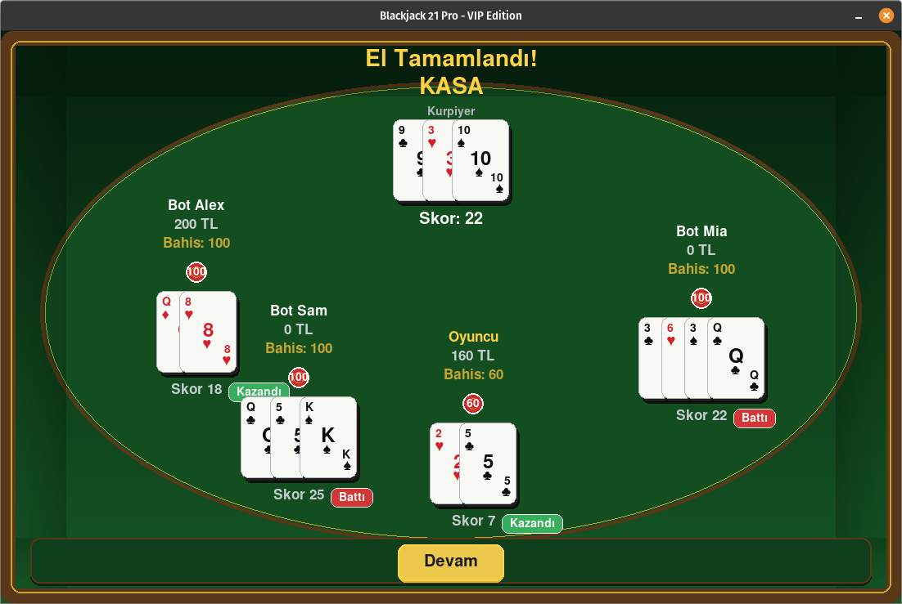

# ♠️ Blackjack 21 Pro - VIP Edition

[](https://www.python.org/)
[](https://www.pygame.org/)
[](https://opensource.org/licenses/MIT)

**Blackjack 21 Pro - VIP Edition**, Python ve **Pygame** kütüphanesi kullanılarak **Nesne Yönelimli Programlama (OOP)** prensipleri doğrultusunda geliştirilmiş, modüler mimariye ve otonom bot yapay zekasına sahip masaüstü bir Blackjack (21) simülasyonudur.

Gerçekçi 4 desteli kart dağıtım mekaniği (The Shoe), dinamik As (Ace) değer yönetimi, bakiye ve kredi limitlerini analiz ederek karar veren bot yapay zekası ve VIP casino masa atmosferiyle eksiksiz bir oyun deneyimi sunar.

---

## 📸 Arayüz & Görseller (Showcase)

| Ana Menü & Mod Seçimi | Oyun İçi Hamle Ekranı |
|:---:|:---:|
|  |  |

<div align="center">
  <h3>Tur Sonu & Sonuç Değerlendirmesi</h3>
  
</div>

---

## 🎯 Öne Çıkan Özellikler
- **🃏 4 Desteli Birleşik Kart Sistemi (The Shoe):** Gerçekçi casino senaryosu için 4 tam destenin birleştirilmesiyle çalışır. Destedeki kart sayısı 15'in altına düştüğünde sistem oyunu kesintiye uğratmadan desteyi otomatik olarak sıfırlar ve yeniden karıştırır.
- **⚡ Dinamik Blackjack Kuralları & Hamleler:**
  - Resimli kartlar (Vale, Kız, Papaz) **10** değerindedir.
  - **Dinamik As Yönetimi:** El toplamı 21'i aştığında oyuncunun patlamasını (*bust*) önlemek için As değeri 11'den 1'e otomatik olarak düşürülür.
  - **Hamle Seçenekleri:** `İste` (Hit), `Kal` (Stand) ve `Double` (Çifte Katla).
- **🤖 Otonom Bot Yapay Zekası:** Masadaki yapay zeka oyuncuları (Bot Alex, Bot Sam, Bot Mia), tur başında mevcut bakiyelerini ve kredi limitlerini analiz ederek casino dinamiklerine uygun kademeli tutarlarda (10, 20, 50, 100) otonom bahis yapar.
- **💰 Finans & Kredi Mekaniği:** Minimum 10 birimlik bahis tabanı bulunur. Oyuncular bakiyeleri tükense dahi -100 birime kadar eksiye düşebilme (kredi/borç) esnekliğine sahiptir.
- **🔄 Özelleştirilebilir Oyun Döngüsü:** Giriş aşamasında oyuncu seçimine sunulan **5 Tur**, **10 Tur** veya **Sınırsız Oyun** modları.
- **🎨 VIP Arayüz & Görsel Geri Bildirimler:** 1100x700 çözünürlükte özel yeşil masa tonları, radyan açılı dairesel oturma düzeni, Segoe UI tipografisi, interaktif butonlar ve anlık durum geri bildirimleri (*Kazandı, Battı, Berabere, Blackjack*).

---

## 🏛️ Mimari ve Modüler Yapı

Proje, sorumlulukların ayrılığı (*Separation of Concerns*) ilkesine bağlı kalarak modüler bir yapıda tasarlanmıştır:

```text
BlackJack/
├── assets/             # Oyun içi ekran görüntüleri (menu, gameplay, round_result)
├── game/               # Oyun döngüsü ve tur akış kontrolleri
├── ui/                 # Kullanıcı arayüzü çizim ve render bileşenleri
├── constants.py        # Renk paletleri, geometrik sabitler, buton koordinatları
├── display.py          # Grafik motoru başlatıcı, font yönetimi, FPS Clock
├── kart_sistemi.py     # Card ve Deck OOP sınıfları, deste yönetimi
├── oyuncu_sistemi.py   # Player sınıfı, bot yapay zekası, dinamik el hesabı
├── main.py             # Uygulama giriş noktası (Entry Point)
├── requirements.txt    # Bağımlılıklar (pygame)
├── .gitignore          # Git tarafından yok sayılacak dosyalar
└── README.md           # Proje dokümantasyonu
```

### Module Responsibilities
*   **constants.py (Constants and Configuration):** RGB color definitions for green table tones, card/button colors, shadows, and feedback states. Screen resolution (1100x700), card dimensions (70x100), interface paddings, and table seating angles in radians. Button interaction coordinates (Hit, Stand, Double, Bet +/-) defined with `pygame.Rect` objects.
*   **display.py (Display and Typography):** Initialization of the Pygame engine and window creation with the `init_display()` function. Global Segoe UI font family loaded in different sizes and weights. Pygame Clock object for frame rate synchronization.
*   **kart_sistemi.py (Card and Deck Mechanics):** `Card` class: Models the card suit (Hearts, Spades, Diamonds, Clubs) and value; calculates the blackjack score with `get_bj_value()`. `Deck` class: Combines 4 decks, shuffles with `random.shuffle()`; automatically resets and distributes the deck when the card count falls below 15.
*   **oyuncu_sistemi.py (Player, Bot and Mathematical Logic):** `Player` class: Manages real player and bot data (name, balance, current bet, hand). Bot Logic: Autonomous bet determination algorithm based on balance status within `reset_hand()`. Finance Control: Borrowing control up to -100 units with `max_bet_for()` and `can_afford_bet()`. `calculate_hand()`: Scoring mechanism that dynamically manages the Ace card's 11 or 1 value to prevent busting.
*   **main.py (Main Executor):** The entry point of the system. Boots up screen components (`init_display()`) and starts the game by triggering the main game loop.

---

## 🚀 Installation and Execution

### Requirements
*   Python 3.8 or higher
*   Pygame 2.5+

### Execution Steps

1. Clone the repository:
```bash
git clone https://github.com/Aleyna-Sahan/blackjack-21-pro-vip.git
cd blackjack-21-pro-vip
```

2. Install required libraries:
```bash
pip install -r requirements.txt
```

3. Start the game:
```bash
python3 main.py
```

---

## 🎮 Game Controls

| Control | Function |
| :--- | :--- |
| **Hit** | Draws 1 new card from the deck to the player's hand. |
| **Stand** | Locks the current hand score and passes the turn to the next player/dealer. |
| **Double** | Doubles the bet amount, draws only 1 card, and ends the player's turn. |
| **Bet (+ / -)** | Increases or decreases the bet amount before the round starts. |
| **Round Selection** | Provides the choice of 5 rounds, 10 rounds, or unlimited mode at the beginning of the game. |

---

## 📜 License
This project is licensed under the MIT License.
