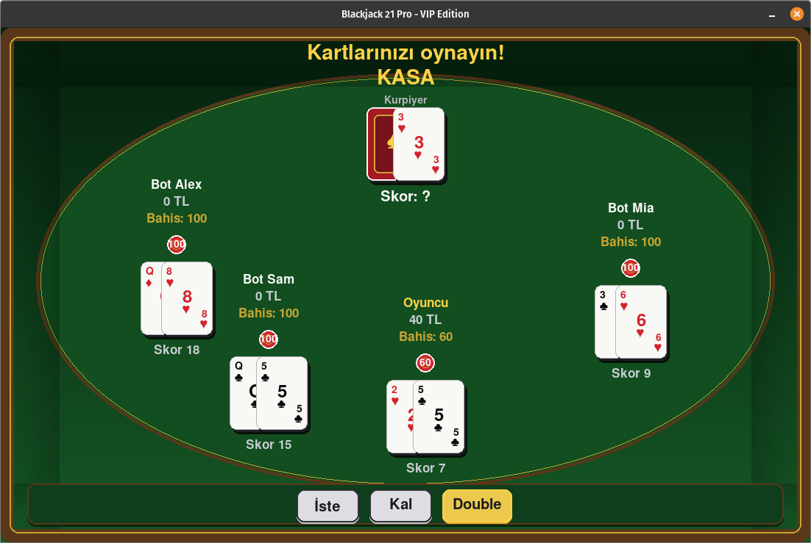

# ♠️ Blackjack 21 Pro - VIP Edition

[](https://www.python.org/)
[](https://www.pygame.org/)
[](https://opensource.org/licenses/MIT)

**Blackjack 21 Pro - VIP Edition**, Python ve **Pygame** kütüphanesi kullanılarak **Nesne Yönelimli Programlama (OOP)** prensipleri doğrultusunda geliştirilmiş, modüler mimariye ve otonom bot yapay zekasına sahip masaüstü bir Blackjack (21) simülasyonudur.

Gerçekçi 4 desteli kart dağıtım mekaniği (The Shoe), dinamik As (Ace) değer yönetimi, bakiye ve kredi limitlerini analiz ederek karar veren bot yapay zekası ve VIP casino masa atmosferiyle eksiksiz bir oyun deneyimi sunar.

---

## 📸 Ekran Görüntüsü
<div align="center">
  
</div>

---

## 🎯 Öne Çıkan Özellikler
- **🃏 4 Desteli Birleşik Kart Sistemi (The Shoe):** Gerçekçi casino senaryosu için 4 tam destenin birleştirilmesiyle çalışır. Destedeki kart sayısı 15'in altına düştüğünde sistem oyunu kesintiye uğratmadan desteyi otomatik olarak sıfırlar ve yeniden karıştırır.
- **⚡ Dinamik Blackjack Kuralları & Hamleler:**
  - Resimli kartlar (Vale, Kız, Papaz) **10** değerindedir.
  - **Dinamik As Yönetimi:** El toplamı 21'i aştığında oyuncunun patlamasını (*bust*) önlemek için As değeri 11'den 1'e otomatik olarak düşürülür.
  - **Hamle Seçenekleri:** `Hit` (Kart İste), `Stand` (Kal) ve `Double` (Çifte Katla).
- **🤖 Otonom Bot Yapay Zekası:** Masadaki yapay zeka oyuncuları, tur başında mevcut bakiyelerini ve kredi limitlerini analiz ederek casino dinamiklerine uygun kademeli tutarlarda (10, 20, 50, 100) otonom bahis yapar.
- **💰 Finans & Kredi Mekaniği:** Minimum 10 birimlik bahis tabanı bulunur. Oyuncular bakiyeleri tükense dahi -100 birime kadar eksiye düşebilme (kredi/borç) esnekliğine sahiptir.
- **🔄 Özelleştirilebilir Oyun Döngüsü:** Giriş aşamasında oyuncu seçimine sunulan **5 Tur**, **10 Tur** veya **Sınırsız Oyun** modları.
- **🎨 VIP Arayüz & Görsel Geri Bildirimler:** 1100x700 çözünürlükte özel yeşil masa tonları, radyan açılı dairesel oturma düzeni, Segoe UI tipografisi, interaktif butonlar ve anlık durum geri bildirimleri (*Kazanma, Kaybetme, Beraberlik, Blackjack*).

---

## 🏛️ Mimari ve Modüler Yapı

Proje, sorumlulukların ayrılığı (*Separation of Concerns*) ilkesine bağlı kalarak modüler bir yapıda tasarlanmıştır:

```text
BlackJack/
├── assets/             # Oyun içi ekran görüntüleri ve görsel materyaller
├── game/               # Oyun döngüsü ve tur akış kontrolleri
├── ui/                 # Kullanıcı arayüzü çizim ve render bileşenleri
├── constants.py        # Renk paletleri, geometrik sabitler, buton koordinatları
├── display.py          # Grafik motoru başlatıcı, font yönetimi, FPS Clock
├── kart_sistemi.py     # Card ve Deck OOP sınıfları, deste yönetimi
├── oyuncu_sistemi.py   # Player sınıfı, bot yapay zekası, dinamik el hesabı
├── main.py             # Uygulama giriş noktası (Entry Point)
├── requirements.txt    # Bağımlılıklar (pygame)
├── .gitignore          # Git tarafından yok sayılacak dosyalar
└── README.md           # Proje dokümantasyonu
```

### Modül Sorumlulukları
*   **constants.py (Sabit Değişkenler ve Konfigürasyon):** Masanın yeşil tonları, kart/buton renkleri, gölgeler ve geri bildirim durumları için RGB renk tanımları. Ekran çözünürlüğü (1100x700), kart ebatları (70x100), arayüz boşlukları ve radyan cinsinden masa oturma açıları. `pygame.Rect` nesneleri ile tanımlanmış buton etkileşim koordinatları (Hit, Stand, Double, Bet +/-).
*   **display.py (Görüntü ve Tipografi):** `init_display()` fonksiyonu ile Pygame motorunun başlatılması ve pencerenin oluşturulması. Farklı boyut ve kalınlıklarda yüklenen global Segoe UI font ailesi. Kare hızı senkronizasyonu için Pygame Clock nesnesi.
*   **kart_sistemi.py (Kart ve Deste Mekanikleri):** `Card` sınıfı: Kart türünü (Kupa, Maça, Karo, Sinek) ve değerini modeller; `get_bj_value()` ile blackjack puanını hesaplar. `Deck` sınıfı: 4 desteyi birleştirir, `random.shuffle()` ile karıştırır; kart sayısı 15'in altına düştüğünde desteyi otomatik yenileyerek dağıtım yapar.
*   **oyuncu_sistemi.py (Oyuncu, Bot ve Matematiksel Mantık):** `Player` sınıfı: Gerçek oyuncu ve bot verilerini (isim, bakiye, güncel bahis, el) yönetir. Bot Mantığı: `reset_hand()` içinde bakiye durumuna göre otonom bahis belirleme algoritması. Finans Denetimi: `max_bet_for()` ve `can_afford_bet()` ile -100 birime kadar borçlanma kontrolü. `calculate_hand()`: Patlamaları önlemek için As kartının 11 veya 1 değerini dinamik olarak yöneten puanlama mekanizması.
*   **main.py (Ana Çalıştırıcı):** Sistemin giriş noktasıdır (Entry Point). Ekran bileşenlerini ayağa kaldırır (`init_display()`) ve ana oyun döngüsünü tetikleyerek oyunu başlatır.

---

## 🚀 Kurulum ve Çalıştırma

### Gereksinimler
*   Python 3.8 veya üzeri
*   Pygame 2.5+

### Çalıştırma Adımları

1. Repoyu klonlayın:
```bash
git clone https://github.com/KULLANICI_ADINIZ/blackjack-21-pro-vip.git
cd blackjack-21-pro-vip
```

2. Gerekli kütüphaneleri yükleyin:
```bash
pip install -r requirements.txt
```

3. Oyunu başlatın:
```bash
python3 main.py
```

---

## 🎮 Oyun Kontrolleri

| Kontrol | İşlev |
| :--- | :--- |
| **Hit (Kart İste)** | Desteden oyuncunun eline 1 yeni kart çeker. |
| **Stand (Kal)** | Mevcut el puanını sabitler ve sırayı bir sonraki oyuncuya/krupiyeye devreder. |
| **Double (Çifte Katla)** | Bahis miktarını ikiye katlar, yalnızca 1 kart çeker ve oyuncunun sırasını sonlandırır. |
| **Bet (+ / -)** | Tur başlamadan önce bahis tutarını artırır veya azaltır. |
| **Tur Seçimi** | Oyun başında 5 tur, 10 tur veya sınırsız mod tercihi sağlar. |

---

## 📜 Lisans
Bu proje MIT Lisansı kapsamında lisanslanmıştır.
